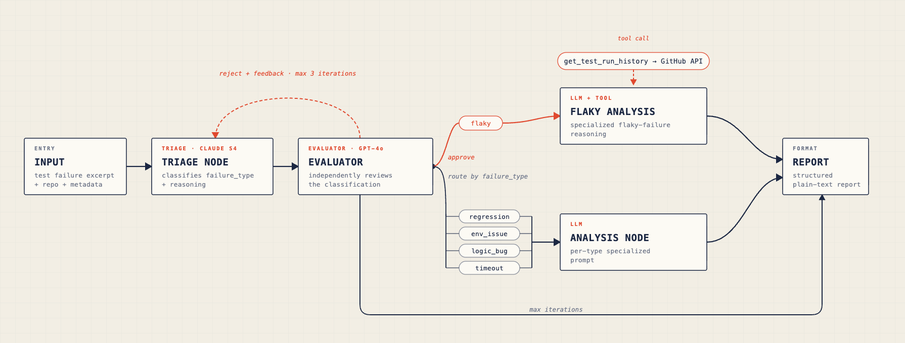

# Hi, I'm Marcelo 👋

I build systems at the intersection of **AI agents**, **cryptography**, and **confidential computing**.

My background spans cryptographic hardware (PhD), SGX-based key management in production (Ava Labs, $2B+ in assets), and agentic AI systems built with LangGraph, CrewAI, and the Anthropic and OpenAI SDKs.

---

## Featured Projects

### 🔒 [Confidential AI Agent](https://github.com/mkaihara/confidential-ai-agent)

A LangGraph agent that calls Claude from inside an Intel SGX enclave. The API key never touches the host. Every response is cryptographically signed and independently verifiable via DCAP remote attestation.

```
Host (LangGraph) ──TCP──▶ SGX Enclave (Gramine + Python)
                               │
                          Sealed storage
                          API key + ECDSA signing key
                          encrypted with hardware key
```

**What makes it real, not conceptual:**
- ECDSA-P256 output signing: `sign(SHA256(prompt ‖ result ‖ timestamp ‖ MRENCLAVE))`
- DCAP quote binds signing key to enclave measurement via Intel's PKI
- Standalone verification CLI — validates the full trust chain without a running enclave
- Sealed storage using `_sgx_mrenclave` hardware key — no external wrap key after bootstrap

---

### 🧪 [Tester Agent](https://github.com/mkaihara/tester-agent)

An autonomous CI test failure analyst built with LangGraph. Classifies failures, performs root cause analysis via tool-augmented reasoning, and generates structured reports. Features a reflection loop where a GPT-4o evaluator independently reviews every Claude triage classification before routing proceeds.



**What makes it genuinely agentic:**
- The reflection loop uses two different model families (Claude + GPT-4o) to reduce shared systematic bias — a single-model loop would approve its own wrong answers
- For flaky failures, the LLM decides whether to call `get_test_run_history` — querying pass/fail rates across 50 recent CI runs at the test level, not the workflow level
- Conditional routing means each failure type receives a specialized diagnostic prompt, not a generic one

---

## Stack

`Intel SGX` · `Gramine` · `LangGraph` · `Anthropic SDK` · `OpenAI SDK` · `DCAP attestation` · `Python` · `Azure DCsv3`

---

## Connect

[LinkedIn](https://www.linkedin.com/in/mkaihara) · [marcelokaihara.com](https://www.marcelokaihara.com)
